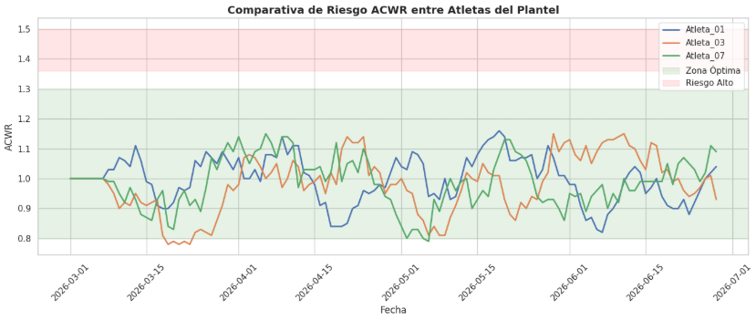
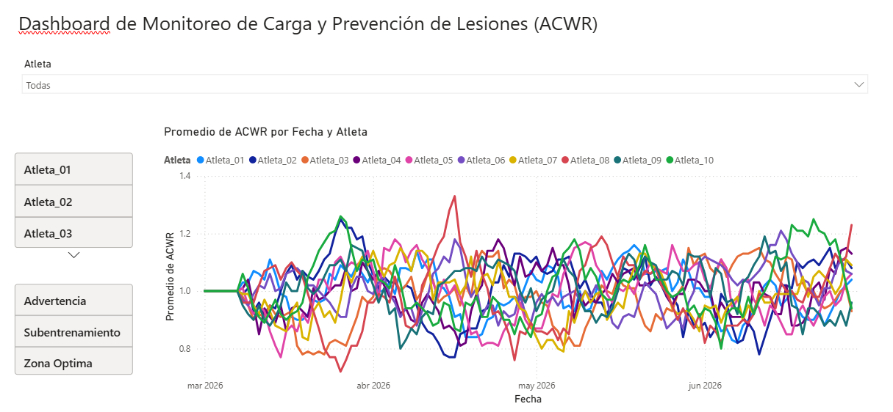

# ACR-Injury-Prevention-Analytics
Modelo de analítica deportiva para el monitoreo de carga de trabajo y prevención de lesiones utilizando Python, Pandas y Power BI. 

# ⚽ Sports Analytics: Monitoreo de Cargas de Trabajo y Prevención de Lesiones (Modelo ACWR)

Este proyecto implementa una solución de analítica deportiva avanzada basada en el modelo **Acute:Chronic Workload Ratio (ACWR)**. La metodología permite cuantificar el riesgo de lesión muscular por sobrecarga o subentrenamiento en futbolistas profesionales, facilitando la toma de decisiones para preparadores físicos y cuerpos técnicos.

---

## 📌 Problemática y Metodología (ACWR)

El modelo **ACWR** compara la carga de trabajo reciente del atleta con la carga a la que se ha adaptado históricamente:
* **Carga Aguda (7 días):** Mide la fatiga acumulada a corto plazo.
* **Carga Crónica (28 días):** Mide la capacidad física y adaptación atlética acumulada.

### Zonas de Control de Riesgo:
* **< 0.80**: Subentrenamiento (Riesgo de desacondicionamiento físico).
* **0.80 - 1.30:** Zona Óptima (Bajo riesgo de lesión).
* **1.30 - 1.49:** Advertencia (Incremento acelerado de fatiga).
* **≥ 1.50:** Riesgo Alto (Incremento drástico del riesgo de lesión muscular).

---

## 🛠️ Tecnologías y Herramientas
* **Python (Google Colab):** Simulación de datos, preprocesamiento con `pandas` y cálculo de ventanas móviles (`rolling`).
* **Matplotlib & Seaborn:** Visualización avanzada de series temporales de rendimiento.
* **Power BI:** Dashboard ejecutivo interactivo para monitoreo en tiempo real.

---

## 📊 Arquitectura del Proyecto y Resultados

### 1. Procesamiento y Modelado en Python
Se simularon **1,200 registros** correspondientes a un plantel de **10 atletas durante 120 días** de temporada. Se aplicaron transformaciones por agrupamiento (`groupby`) para calcular las ventanas móviles dinámicas de 7 y 28 días por jugador.

### 2. Dashboard Interactivo en Power BI
Se construyó un panel directivo que permite:
* Filtrar individualmente por jugador o ver el comportamiento global del equipo.
* Visualizar en tiempo real las alertas de **Zona de Riesgo** (Óptima, Advertencia, Riesgo Alto).
* Analizar tendencias del ACWR día a día.

---

## Proyecto desarrollado como parte del portafolio profesional en Data Science & Sports Analytics.
